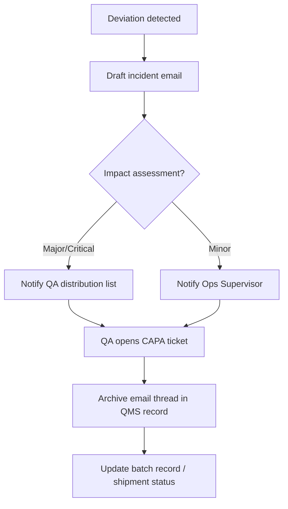

title: Good Documentation Practice (GDP) – Paper Records
sidebar_label: GDP Core SOP
---

# 01-SOP-GDP-Core: Good Documentation Practices

## 1. Purpose
Define Good Documentation Practices (GDP) for all **paper (manual) GMP records** to ensure they are Attributable, Legible, Contemporaneous, Original, Accurate, Complete, Consistent, Enduring, and Available (ALCOA+). This SOP enables compliance with FDA 21 CFR 210–211 (esp. 211.180, 211.182, 211.186, 211.188, 211.194), EU GMP Chapter 4 and Annex 15, PIC/S PI 041-1 (2021), and WHO GDP guidance (TRS 1033/996).

Scope: Applies to all paper GMP documents used in manufacturing, packaging, QC/QA, warehouse, engineering, and training. Electronic/hybrid systems are covered separately.

## 2. References
- FDA 21 CFR Part 211 Subpart J – Records and Reports
- EU GMP EudraLex Vol. 4 Chapter 4; Annex 15 (GDP in validation docs)
- PIC/S PI 041-1 (2021) – Good Practices for Data Management and Integrity
- WHO TRS 1033 (2021) Annex 4; TRS 996 Annex 5 – GDP/Data Integrity

## 3. Definitions
- **GDP:** Practices ensuring ALCOA+ compliance for records.
- **ALCOA+:** Attributable, Legible, Contemporaneous, Original, Accurate, Complete, Consistent, Enduring, Available.
- **Controlled document:** Approved, versioned, issued document (SOP, form, logbook, batch record).
- **True copy:** Verified copy that preserves content/meaning of the original.

## 4. Roles and Responsibilities
- **All personnel:** Record data in real time, legibly, with indelible ink; follow correction rules; use only controlled documents.
- **Supervisors/Managers:** Ensure training; verify contemporaneous completion; reject records with GDP errors.
- **Quality Unit (QA/QC):** Owns GDP system; controls issuance; reviews/approves records; investigates discrepancies per 21 CFR 211.192; enforces CAPA; manages archives.
- **Document Control/Archivist:** Issues controlled copies/logbooks; maintains master lists; archives and retrieval.
- **Training:** Provides initial and periodic GDP training; keeps GDP-compliant training records.

## 5. Document Types & Format Requirements
- **Batch Production Records (BPRs):** Controlled copy of approved master (21 CFR 211.186). Pages pre-numbered “Page X of Y”; space for date/time, performer, verifier; attachments signed/dated.
- **Equipment/Room Logbooks:** Bound, pre-numbered; entries chronological with date/time, activity, performer, verifier (211.182).
- **Laboratory Records:** Bound/controlled worksheets; include sample ID, method, raw data, calculations, results, analyst & reviewer signatures (211.194). Attach labeled printouts signed/dated.
- **Cleaning/Temperature/Issuance Logs:** Pre-defined columns; no blanks (use N/A, initial/date).
- **Labels/Status Tags:** Handwritten fields in indelible ink; errors corrected per Section 7 or label replaced/retained with explanation.
- **Forms/Templates:** Controlled, versioned, issued by Document Control; unused sections marked “N/A” and initialed/dated; no ad‑hoc forms.

## 6. Core GDP Rules for Handwritten Entries
- **Ink & legibility:** Indelible blue/black ink only; no pencil/erasable ink/correction fluid or tape; no overwrites.
- **Timeliness:** Record at time of activity. No backdating; late entry must state “Late entry,” current date/time, reason.
- **Completeness:** No blank fields; mark N/A and initial/date when not applicable.
- **Accuracy:** Record actual observations/values with required units; avoid ditto marks; use approved abbreviations only.
- **One event per line:** Use separate rows; add referenced continuation sheets if needed.

## 7. Corrections and Error Handling
- Single-line strike-through; original remains legible.
- Write correct entry nearby, initial/date; add reason for critical data or non-obvious changes.
- Never overwrite/obliterate. 
- If page unusable: mark “VOID,” sign/date, retain; rewrite on new controlled page and cross-reference.
- Errors impacting quality trigger deviation/investigation per 21 CFR 211.192.
- **Scribes:** Only when operator cannot write (e.g., aseptic); scribe signs/dates; operator countersigns ASAP noting “Recorded by [scribe] for [operator].”

## 8. Signatures, Initials, and Dates
- Each attributable entry signed/initialed and dated at time of entry.
- Standard date format (e.g., DD-MMM-YYYY); include time when required.
- Maintain controlled signature/initial log (specimen signatures/initials, printed name, role).
- Double checks: critical steps/calculations signed by performer and independent verifier (211.188(b), 211.194(a)).

## 9. Document Control
- Only current approved versions in use; obsolete versions withdrawn/archived.
- Issuance of BPRs/logbooks/forms by QA/Doc Control with unique IDs/page counts.
- No unofficial notebooks or photocopied “home-made” forms for GMP data.
- Pagination: each multi-page document labeled with document ID and “Page X of Y.”

## 10. Review, Approval, and Error Resolution
- In-process checks by supervisors/QA for completeness and real-time recording.
- Post-use review by responsible area; QA review for completeness, legibility, proper corrections, required signatures before release.
- Errors found after approval handled via formal addendum/deviation; originals not altered.
- Periodic GDP self-inspections by QA; trends drive retraining/CAPA.

## 11. Archiving and Retention
- Retention (minimum): Batch/packaging/analysis records ≥ 1 year after expiry or ≥ 5 years after QP release (EU) – follow longest applicable requirement; equipment/logs/training ≥ 5 years or per local law.
- Storage: secure, controlled; protect from moisture/heat/light; access-controlled; retrieval log maintained.
- Destruction after retention only with QA approval and documented secure destruction.

## 12. Training
- GDP training before independent work; periodic refresh (e.g., annually or upon trend/change).
- Training records must comply with GDP (signed/dated by trainee and trainer).

## 13. Common Pitfalls & Prevention
- Illegible entries → block letters; reviewers flag and clarify.
- Blanks/missing signatures → use N/A and initial/date; QA checklist.
- Backdating → prohibited; use late-entry notation with reason.
- Unofficial notes → use controlled forms; attach unavoidable scratch notes and transcribe with linkage.
- White-out/overwrites → never; single-line strike-through only.

## 14. Attachments
- Signature/Initials Log (controlled document)
- Issuance logs for batch records and logbooks
- GDP training form template

## 15. Flow Example – Email Handling (Communications GDP)

---
*Aligned with FDA 21 CFR 211, EU GMP Chapter 4/Annex 15, PIC/S PI 041-1, WHO GDP guidance.*
