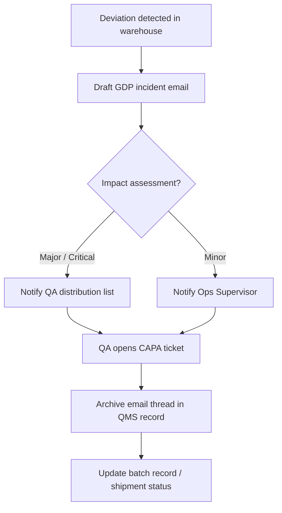

# 01-SOP-GDP-Core: Good Documentation Practices (GDP)

## 1. Purpose

To establish the standards for creating, recording, and correcting data to ensure Data Integrity. This applies to both paper-based records (e.g., logbooks) and electronic records (e.g., eQMS, Git commits, ERP entries).

## 2. Scope

This procedure applies to all personnel generating GxP data.

## 3. The Golden Rule: ALCOA+

All data must meet the ALCOA+ principles. If data does not meet these criteria, it is considered a Data Integrity violation.

| Principle           | Definition        | Practical Rule                                                                                        |
| :------------------ | :---------------- | :---------------------------------------------------------------------------------------------------- |
| **A**ttributable    | Who did it?       | Never share passwords. Signatures must be unique to the individual.                                   |
| **L**egible         | Can it be read?   | No pencil. No white-out. Electronic records must be permanently readable.                             |
| **C**ontemporaneous | When was it done? | Record data _at the time_ the activity is performed. Backdating is strictly prohibited.               |
| **O**riginal        | Is it the source? | Do not write on sticky notes/scrap paper and transcribe later. The first record is the _only_ record. |
| **A**ccurate        | Is it correct?    | Verify calculations. Validate data inputs.                                                            |

## 4. Procedure for Paper Records

### 4.1 Entries

- Use **indelible blue or black ink** only.
- Never use pencil or erasable ink.
- Empty fields must be struck through with a single line and marked "N/A" (Not Applicable).

### 4.2 Corrections

If an error is made on a paper record:

1.  Draw a **single line** through the error (the original text must remain legible).
2.  Write the correct value next to it.
3.  Initial and Date the correction.
4.  Provide a reason for change if not obvious (e.g., _"Calc. Error"_ or _"Typo"_).

- **NEVER:** Use correction fluid (White-Out), scribble over text, or use "sticky tape" to cover errors.

## 5. Procedure for Electronic Records

### 5.1 System Access

- User accounts must be unique. **Generic accounts** (e.g., "LabAdmin", "Operator1") are prohibited for GxP actions.
- Passwords must not be written down or shared.

### 5.2 Audit Trails

- Audit trails must be enabled for all GxP systems.
- It is prohibited to turn off an audit trail to perform an action.
- **Git Commits:** Git commit messages serve as the audit trail for code/documentation changes. Messages must be meaningful (e.g., _"Fix: Update temp threshold"_ not _"Updated file"_).

### 5.3 Date and Time

- Systems must be synchronized to a reliable clock source (NTP).
- Users must not be able to change the system clock to falsify timestamps.

## 6. Signature Manifestation

A signature (handwritten or electronic) signifies:

- **"Prepared by":** I performed the action and recorded the data.
- **"Reviewed by":** I have checked the data for accuracy, completeness, and compliance.
- **"Approved by":** I authorize the document for use.

## 7. Email Handling Flow (Mermaid)

## 7. References

- FDA Data Integrity and Compliance with Drug CGMP (Guidance for Industry)
- MHRA 'GXP' Data Integrity Guidance and Definitions
- 21 CFR Part 11 (Electronic Records)
