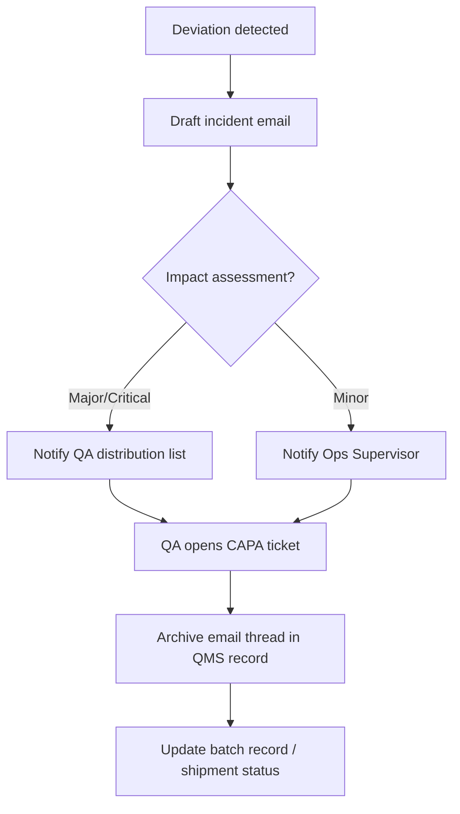

# 01-SOP-GDP-Core: Good Documentation Practices for Paper Records

## 1. Purpose
Establish Good Documentation Practices (GDP) for all **paper (manual) GMP records** to assure data integrity (ALCOA+), product quality, and regulatory compliance.

## 2. Scope
Applies to all paper GMP documents used in manufacturing, packaging, QC, QA, warehousing, engineering, calibration/maintenance, and training across this facility. Electronic/hybrid records are addressed in separate SOPs.

## 3. References
- FDA 21 CFR 210–211 (esp. 211.180, 211.182, 211.186, 211.188, 211.194)
- EU GMP / EudraLex Vol. 4 Chapter 4 and Annex 15
- PIC/S PI 041-1 (2021) – Good Practices for Data Management and Integrity
- WHO GDP Guidance (TRS 1033 Annex 4; TRS 996 Annex 5)

## 4. Definitions
- **ALCOA+:** Attributable, Legible, Contemporaneous, Original, Accurate, Complete, Consistent, Enduring, Available.
- **Controlled document:** Approved, versioned, issued document (SOP, master form, batch record, logbook).
- **True copy:** Verified copy that preserves content/meaning of the original.
- **Late entry:** Entry made after the activity; must be identified and explained.

## 5. Roles and Responsibilities
- **All personnel:** Record in real time, legibly, in indelible ink; follow correction rules; use only controlled documents.
- **Supervisors/Managers:** Ensure staff are trained; verify contemporaneous completion; refuse/return records with GDP errors until corrected properly.
- **Quality Unit (QA/QC):** Owns GDP system; controls issuance of forms/logbooks; reviews/approves records; investigates discrepancies (per 21 CFR 211.192); manages archives; maintains signature/initial log.
- **Document Control/Archivist:** Issues controlled copies/logbooks; maintains master lists; manages storage, retrieval, and destruction after retention.
- **Training:** Provides initial and periodic GDP training; maintains GDP-compliant training records.

## 6. Document Types and Format Requirements
- **Batch Production Records (BPRs):** Controlled copy of approved master (21 CFR 211.186). Pages pre-numbered “Page X of Y”; spaces for date/time, performer, verifier; attachments signed/dated.
- **Equipment/Room Logbooks (211.182):** Bound, pre-numbered; chronological entries of use, cleaning, maintenance with performer and verifier.
- **Laboratory Records (211.194):** Bound/controlled worksheets; include sample ID, method, raw data, calculations, results; analyst and reviewer signatures; labeled printouts attached and signed/dated.
- **Cleaning/Environmental/Temperature Logs:** Pre-defined columns; no blanks (use N/A, initial/date).
- **Labels/Status Tags:** Indelible ink for handwritten fields; errors corrected per Section 8 or label replaced/retained with explanation.
- **Forms/Templates:** Controlled, versioned, issued by Document Control; unused sections marked “N/A” and initialed/dated; no ad‑hoc or photocopied “home-made” forms.

## 7. Core GDP Rules for Entries
- **Ink & legibility:** Indelible blue/black ink only; handwriting must be readable. No pencil, erasable ink, correction fluid/tape, or overwrites.
- **Timeliness:** Record at time of activity. No backdating. If late, label “Late entry,” include current date/time, and reason.
- **Completeness:** Do not leave blanks. Enter data or “N/A” and initial/date where not applicable.
- **Accuracy:** Record actual observations/values with required units/significant figures. No ditto marks; use only approved abbreviations.
- **One event per line:** Use separate rows; if more space needed, use controlled continuation sheet and reference it.

## 8. Corrections and Error Handling
- Single-line strike-through; original remains legible.
- Write correct entry nearby, initial/date; add reason when not obvious or for critical data.
- Never overwrite or obliterate text.
- If an entire page is unusable: mark “VOID,” sign/date, retain; rewrite on new controlled page and cross-reference.
- Significant errors impacting quality trigger deviation/investigation per 21 CFR 211.192.
- **Scribes:** Allowed only when operator cannot write (e.g., aseptic). Scribe signs/dates; operator countersigns ASAP noting “Recorded by [scribe] for [operator].”

## 9. Signatures, Initials, and Dates
- Each attributable entry is signed/initialed and dated at time of entry.
- Use site-standard date format (e.g., DD-MMM-YYYY); include time where required.
- Maintain controlled signature/initial log (specimen signatures/initials, printed name, role).
- Critical steps/calculations require independent verification with second signature/initials (211.188(b), 211.194(a)).

## 10. Document Control and Issuance
- Only current approved versions may be used; obsolete versions withdrawn and archived.
- Issuance of BPRs/logbooks/forms by QA/Doc Control; track unique IDs and page counts.
- Pagination: multi-page documents marked with document ID and “Page X of Y.”
- No unofficial notebooks or uncontrolled photocopies for GMP data.

## 11. Review, Approval, and Error Resolution
- In-process checks by supervisors/QA to verify real-time completion.
- Post-use review by area owner; QA review for completeness, legibility, proper corrections, required signatures prior to release.
- Errors discovered after approval handled via formal addendum/deviation; originals not altered.
- QA performs periodic GDP self-inspections; trends drive retraining/CAPA.

## 12. Archiving and Retention
- Retention (minimum): Batch/packaging/analysis records ≥ 1 year after expiry or ≥ 5 years after QP release (apply longest applicable). Equipment/logs/training: ≥ 5 years or per local law.
- Storage: secure, controlled; protect from moisture/heat/light; access-controlled; retrieval log maintained.
- Destruction after retention only with QA approval and documented secure destruction.

## 13. Training
- GDP training required before independent work and refreshed periodically (e.g., annually or when trends/changes dictate).
- Training records must follow GDP (signed/dated by trainee and trainer).

## 14. Common Pitfalls & Preventive Measures
- Illegible entries → write in block letters; reviewers flag and clarify immediately.
- Blanks/missing signatures → use N/A and initial/date; QA checklists before approval.
- Backdating → prohibited; use late-entry notation with reason.
- Unofficial notes → use controlled forms; if unavoidable, attach original note and transcribe with linkage.
- White-out/overwrites → prohibited; single-line strike-through only with initials/date.

## 15. Flow Example – Communication Record (Email) GDP

---
*Aligned with FDA 21 CFR 211, EU GMP Chapter 4/Annex 15, PIC/S PI 041-1, WHO GDP guidance.*
