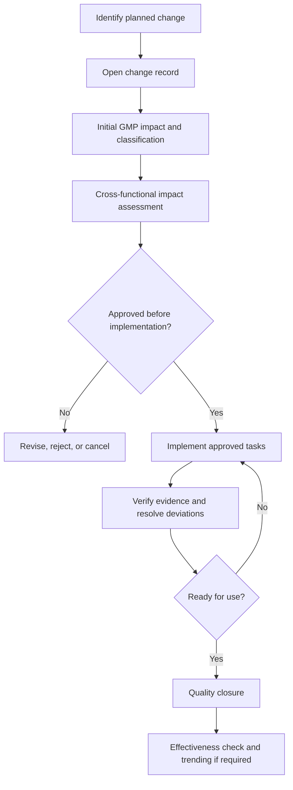

# 01-SOP-CCM: Change Control Management

> **Purpose of this document:** Provide a practical, risk-based procedure for proposing, assessing, approving, implementing, verifying, and closing GMP changes without unintended impact to patient safety, product quality, data integrity, validated state, or regulatory commitments.

---

## 1. Purpose

This SOP defines the site process for controlling planned changes to GMP facilities, utilities, equipment, materials, documents, computerized systems, analytical methods, processes, suppliers, services, packaging, labels, specifications, and quality system procedures.

The change control process must ensure that:

- proposed changes are justified before GMP-state-changing implementation starts
- risks are assessed using scientific knowledge and process understanding
- Quality Unit approval is obtained before implementation when GMP impact exists
- validation, qualification, regulatory, training, documentation, and data integrity impacts are completed before use
- emergency changes are controlled and retrospectively reviewed
- completed changes are verified, closed, trended, and checked for effectiveness where required

## 2. Scope

This SOP applies to all planned GMP changes at the site, including permanent, temporary, emergency, like-for-like, and supplier-driven changes.

### 2.1 In scope

- Manufacturing, packaging, warehousing, laboratory, engineering, maintenance, calibration, cleaning, and quality operations.
- Facilities, rooms, utilities, equipment, instruments, automation, computerized systems, network or infrastructure components supporting GMP activities.
- Product, process, analytical method, specification, master batch record, packaging component, label, cleaning, hold-time, storage, shipping, and sampling changes.
- Raw material, component, supplier, contract laboratory, service provider, and outsourced activity changes.
- SOPs, forms, logbooks, training materials, validation plans, protocols, reports, and controlled templates.
- Changes arising from CAPA, deviation investigation, complaint investigation, audit observation, periodic review, process performance monitoring, or regulatory commitment.

### 2.2 Out of scope

- Unplanned departures from approved instructions. These are managed first as deviations or incidents, then converted to change controls if a planned corrective change is required.
- Editorial document corrections with no GMP meaning, such as spelling, formatting, pagination, or contact detail updates, provided the site document control procedure permits administrative updates.
- Routine work performed exactly as allowed by an approved procedure, preventive maintenance plan, calibration plan, validated recipe range, or approved configuration standard.
- Routine like-for-like replacement managed by an approved maintenance or calibration procedure where equivalence, post-work checks, and escalation criteria are already defined.

## 3. References

- FDA 21 CFR 211.22, 211.68, 211.100, 211.160, 211.180, 211.186, 211.188, 211.192.
- FDA Guidance for Industry: Process Validation: General Principles and Practices.
- FDA Guidance for Industry: Data Integrity and Compliance With Drug CGMP: Questions and Answers.
- EU GMP Chapter 1, Pharmaceutical Quality System.
- EU GMP Chapter 4, Documentation.
- EU GMP Annex 11, Computerised Systems.
- EU GMP Annex 15, Qualification and Validation.
- ICH Q9(R1), Quality Risk Management.
- ICH Q10, Pharmaceutical Quality System.
- Site procedures for deviation, CAPA, document control, validation, supplier qualification, regulatory affairs, training, and computerized system validation.

## 4. Definitions

- **Change control:** A formal process used to propose, assess, approve, implement, verify, and close a planned change.
- **Change owner:** The person accountable for driving the change from initiation to closure.
- **Quality Unit:** The independent quality function with authority to approve or reject GMP-impacting changes.
- **GMP impact:** Potential effect on patient safety, product quality, data integrity, validated state, regulatory filing commitments, or required GMP records.
- **Like-for-like change:** Replacement with the same approved design, specification, material, version, setting, supplier, or performance characteristics. Like-for-like status must be justified, not assumed.
- **Temporary change:** A time-limited change with defined start condition, end condition, expiry date, controls, and reversion plan.
- **Emergency change:** A change required immediately to protect patient safety, product quality, personnel safety, facility integrity, or business continuity. Emergency work may start before full approval only under the controls in Section 11.
- **Implementation tasks:** Approved actions required to put the change in place, such as procedure updates, qualification, validation, training, supplier approval, regulatory submission, data migration, or physical installation.
- **Effectiveness check:** A documented check after implementation to confirm the change achieved its intended outcome and did not create unacceptable new risk.

## 5. Roles and Responsibilities

| Role | Responsibilities |
| --- | --- |
| Change Owner | Opens the change, defines the problem or opportunity, gathers evidence, coordinates assessment, tracks actions, prevents unauthorized implementation, and requests closure. |
| Department Manager / Area Owner | Confirms business need, resource plan, area readiness, training impact, and operational controls. |
| Subject Matter Experts (SMEs) | Assess technical, process, validation, engineering, IT, laboratory, cleaning, supplier, materials, regulatory, and data integrity impacts. |
| Quality Unit | Determines GMP impact, approves classification, approves or rejects the plan, confirms implementation evidence, approves closure, and trends the system. |
| Validation / Qualification | Defines and executes qualification, validation, revalidation, traceability, testing, and report requirements. |
| Regulatory Affairs | Assesses filing, licence, variation, notification, annual report, comparability, and market-specific commitments before implementation. |
| Document Control | Issues, revises, obsoletes, and archives controlled documents affected by the change. |
| Training | Assigns and tracks training before the changed process, system, or document is used. |
| Supplier Quality / Procurement | Assesses supplier, material, outsourced activity, and service-provider impacts. |
| IT / System Owner | Assesses computerized system, access, backup, restore, cybersecurity, infrastructure, audit trail, and data integrity impacts. |

One person may hold more than one role in a small site, but Quality approval authority and independent review must be preserved.

### 5.1 Approval matrix

| Lifecycle gate | Required owner | Required approval / review |
| --- | --- | --- |
| Change initiation | Change Owner | Department Manager or Area Owner review for business need. |
| GMP impact and classification | Quality Unit | Quality approval required for GMP-impacting classification. |
| Impact assessment | Change Owner | Relevant SMEs; Regulatory, Validation, IT/System Owner, and Supplier Quality where applicable. |
| Implementation approval | Change Owner | Quality approval before GMP-state-changing implementation. |
| Release for use | Area Owner / System Owner | Quality approval when GMP operations, validated state, regulatory commitments, or data integrity are affected. |
| Closure | Change Owner | Quality closure approval. |
| Effectiveness check | Change Owner | Quality review of outcome when required. |

## 6. Change Classification

The Quality Unit assigns or approves the final classification based on risk, GMP impact, and complexity.

| Class | Use when | Minimum expectation |
| --- | --- | --- |
| Critical / Major | The change may affect patient safety, product quality, critical process parameters, critical quality attributes, validated state, sterile assurance, data integrity, regulatory commitments, or batch release. | Full cross-functional impact assessment, Quality approval before implementation, validation or documented justification, regulatory assessment, training, closure evidence, and effectiveness check. |
| Moderate | The change affects GMP operations but is unlikely to affect critical controls if managed as planned. | Documented impact assessment, Quality approval, defined implementation tasks, training where needed, verification evidence, and closure. |
| Minor | The change has limited GMP impact and does not affect validated state, regulatory commitments, critical controls, or data integrity. | Abbreviated assessment, Quality approval or delegated Quality review, implementation evidence, and closure. |
| Administrative | The change is editorial or administrative and has no GMP meaning. | Document-control route allowed by local procedure; change control may be waived if justified. |
| Emergency | Immediate implementation is required before normal approval can be completed. | Verbal or written Quality authorization before or as soon as practicable after action, documented risk controls, retrospective full assessment, and closure. |

Classification may be upgraded at any time if new information shows greater risk.

## 7. Change Lifecycle Overview

## 8. Procedure

### 8.1 Identify and open the change

1. Open a change record before GMP-state-changing implementation starts unless the emergency process in Section 11 applies.
2. Describe the current state, proposed future state, reason for change, affected site or area, affected products or materials, and requested implementation date.
3. Link related records, such as deviation, CAPA, complaint, audit observation, supplier notification, validation periodic review, equipment history, regulatory commitment, or management review action.
4. Attach supporting information, such as drawings, specifications, supplier notices, risk assessments, draft procedures, validation history, trend data, or technical reports.
5. Identify whether any GMP-state-changing work is being requested before approval. If yes, document why and obtain Quality Unit authorization.

Planning work may occur before implementation approval when it does not alter GMP state, release product, revise effective records, change approved configuration, or place changed equipment, materials, systems, documents, labels, or processes into routine GMP use. Examples include supplier quotes, draft procedures, design options, sandbox configuration, engineering studies, risk workshops, and procurement planning. If planning work could affect live GMP operations or controlled records, Quality must approve the control strategy before it starts.

### 8.2 Perform initial screening

The Change Owner and Quality Unit screen the change for:

- GMP impact
- affected products, batches, markets, licenses, and regulatory filings
- impact to validated state or control strategy
- data integrity and computerized system impact
- supplier, outsourced activity, and material impact
- need for health, safety, environmental, or business continuity controls
- whether the change is permanent, temporary, emergency, or like-for-like

If the proposed action is actually an unplanned event, open or link a deviation before continuing.

### 8.3 Assess impact

Impact assessment must be proportionate to risk and documented. The assessment must consider the following areas and record either the impact or a justified "not applicable."

| Area | Questions to answer |
| --- | --- |
| Product quality and patient safety | Could identity, strength, purity, safety, efficacy, sterility, contamination control, stability, packaging integrity, or traceability be affected? |
| Process and control strategy | Are critical process parameters, critical quality attributes, proven acceptable ranges, hold times, cleaning limits, environmental controls, sampling plans, or in-process controls affected? |
| Validation and qualification | Are process validation, cleaning validation, analytical method validation, equipment qualification, utility qualification, computerized system validation, or transport qualification affected? |
| Regulatory | Is the change described in a marketing authorization, DMF/ASMF, biologics license, device file, site license, clinical trial application, registered specification, or approved commitment? |
| Documentation | Which SOPs, forms, batch records, logbooks, specifications, drawings, recipes, training documents, labels, or validation documents must change? |
| Data integrity | Are electronic records, audit trails, metadata, calculations, interfaces, manual transcription steps, backup/restore, archive, or record retention affected? |
| Computerized systems | Are user requirements, configuration, access roles, reports, interfaces, recipes, audit trails, infrastructure, cybersecurity, or periodic review status affected? |
| Materials and suppliers | Are approved suppliers, material grades, specifications, test methods, certificates, supply chain, or technical agreements affected? |
| Operations and training | Who must be trained before use? Are job aids, line clearance, cleaning, calibration, maintenance, or operator qualifications affected? |
| Existing inventory and WIP | What happens to open batches, quarantined stock, labels, printed forms, old components, or work in progress? |
| Other quality systems | Are deviations, CAPA, complaints, recalls, annual product review, stability, or management review affected? |

### 8.4 Define the implementation plan

The implementation plan must be specific enough that a reviewer can understand exactly what will happen before the change is used.

At minimum, define:

- required approvals before implementation
- tasks, owners, and due dates
- documents to create, revise, obsolete, or archive
- validation or qualification deliverables and acceptance criteria
- regulatory actions and required approval or notification timing
- training required before use
- controls for existing inventory, open batches, labels, templates, and system access
- rollback or contingency plan when failure would affect product quality or continuity
- evidence required for closure
- whether effectiveness check is required and when it will occur

Do not implement GMP-impacting changes from informal emails, meeting notes, tickets, or verbal requests alone. Those records may support the change, but the approved change record is the controlling record.

### 8.5 Approve before implementation

1. The Change Owner routes the complete impact assessment and implementation plan for review.
2. Required SMEs confirm their sections are complete.
3. Regulatory Affairs confirms filing impact before implementation when a registered detail may be affected.
4. Validation confirms validation impact and acceptance criteria.
5. The Quality Unit approves, rejects, or requests revision.
6. GMP-state-changing implementation must not start until approval is granted unless the emergency process applies.

Quality approval means the plan is acceptable to execute. It does not mean the change is released for routine use. Routine use begins only after required implementation evidence is complete and Quality releases the change or affected item for use.

### 8.6 Implement the approved change

1. Perform only the approved tasks. If scope changes, pause and revise the change record before continuing.
2. Record objective evidence for each task, such as completed protocol, approved report, issued SOP, completed training, installed part record, calibration certificate, supplier approval, test result, or screenshot/report export where appropriate.
3. Manage deviations, failed tests, unexpected results, or incomplete tasks through deviation or discrepancy records linked to the change.
4. Maintain segregation of old and new materials, documents, labels, forms, recipes, or configurations until cutover is approved.
5. For computerized systems, ensure access, audit trail, backup, restore, reporting, interfaces, and data migration controls are verified as defined in the validation plan.

### 8.7 Verify readiness for use

Before the changed process, system, equipment, material, or document is released for routine GMP use, verify that:

- all required approvals are complete
- validation and qualification acceptance criteria are met or deviations are justified and approved
- required documents are effective and obsolete versions are withdrawn
- required training is complete
- regulatory pre-approval or notification timing has been met where applicable
- materials, labels, forms, and records are controlled during cutover
- open deviations or CAPA actions do not prevent safe use
- rollback or contingency controls are available where required

Quality must explicitly approve release for use when the change affects GMP operations, validated state, registered commitments, or data integrity.

### 8.8 Close the change

The Change Owner requests closure when implementation is complete.

The closure package must include:

- final summary of what changed
- confirmation that approved tasks are complete
- list of linked documents, validation records, deviations, CAPA, training, and regulatory records
- final disposition of affected inventory, documents, labels, components, or configurations
- summary of unresolved items and justification for closure, if any
- effectiveness check plan or documented rationale for not requiring one

Quality reviews the closure package and either approves closure or returns it for completion.

### 8.9 Perform effectiveness check

An effectiveness check is required for critical/major changes and for any change initiated by CAPA, recurring deviation, audit observation, complaint trend, or process performance issue unless Quality justifies otherwise.

Effectiveness checks may include:

- review of first batches, first lots, first use, or first release after change
- deviation, reject, complaint, OOS, OOT, environmental, maintenance, calibration, or alarm trend review
- audit trail or data review
- user access or security review
- review of training errors or operator feedback
- supplier performance review
- confirmation that the original problem did not recur

If the effectiveness check fails, open a deviation, CAPA, or new change control as appropriate.

## 9. Temporary Changes

Temporary changes require additional controls because they create a planned exception to normal operation.

Temporary change records must include:

- reason the temporary state is needed
- start date or trigger
- expiry date or maximum duration
- affected products, batches, systems, areas, or users
- additional controls during the temporary period
- required monitoring or review frequency
- reversion plan or conversion to permanent change
- owner responsible for expiry tracking

Quality must approve any extension before expiry. Expired temporary changes must not remain in use.

## 10. Like-for-Like Changes

Like-for-like changes may use a reduced assessment only when equivalence is documented.

Examples may include replacement of a failed component with the same approved part number, material, specification, firmware/software version, drawing, and performance characteristics.

Routine like-for-like replacement may be managed under approved maintenance, calibration, or operational procedures when equivalence criteria and post-work checks are already defined. Use change control when equivalence is not pre-approved, GMP risk is higher, validated state may be affected, the replacement introduces a new supplier/version/material/design, or local procedure requires escalation.

The record must confirm:

- item or condition being replaced
- approved equivalent replacement
- no change to intended use, specification, critical function, configuration, software version, material contact surface, calibration range, or validated state
- installation or maintenance record completed
- calibration, functional check, or verification completed where needed

If equivalence cannot be shown, the change is not like-for-like.

## 11. Emergency Changes

Emergency changes are allowed only when delay could increase risk to patient safety, product quality, personnel safety, facility integrity, or continuity of a critical GMP process.

Emergency process:

1. Contact Quality as soon as possible before action. If Quality cannot be reached before immediate protective action, notify Quality as soon as practicable.
2. Record the reason for emergency action, risk controls, people involved, date/time, and affected items.
3. Limit the change to the minimum action needed to stabilize the situation.
4. Open or link a deviation or incident record when the emergency action involved an unplanned departure, uncontrolled condition, failed system, or potential product-quality impact.
5. Place affected batches, materials, records, labels, systems, or equipment on hold or equivalent control until Quality disposition is complete when product quality or data integrity may be affected.
6. Open a formal change record within one business day unless local procedure defines a shorter period.
7. Complete retrospective impact assessment, validation assessment, regulatory assessment, product or record disposition, and closure evidence.
8. Prevent release or use of affected product, records, systems, or equipment until the impact assessment and any required verification are approved by Quality.
9. Decide whether the emergency state is reverted, approved as temporary, or converted to a permanent change.

Emergency status must not be used to bypass normal planning for convenience, schedule pressure, or poor forecasting.

## 12. Regulatory Assessment

Regulatory Affairs must assess whether the change affects approved or pending regulatory submissions, site licenses, marketing authorizations, product registrations, variation commitments, comparability protocols, post-approval commitments, or market-specific requirements.

The change record must state one of the following:

- no regulatory impact, with rationale
- reportable after implementation
- notification required before or after implementation
- prior approval required before implementation
- market-by-market decision required

Changes requiring prior regulatory approval must not be implemented for routine manufacture, release, distribution, or use in affected markets until approval is received. Exceptional containment or corrective action needed to protect patient safety or product quality must be handled under deviation, segregation or hold controls, Quality approval, and Regulatory Affairs escalation; it must not be used as routine implementation of a prior-approval change before agency approval.

## 13. Validation and Qualification Assessment

Validation must assess whether the change affects:

- validated process, cleaning, analytical method, sterilization, packaging, transport, storage, or computerized system state
- user requirements, functional requirements, configuration, recipes, reports, interfaces, calculations, audit trails, or data migration
- equipment, instrument, utility, facility, or automation qualification
- critical process parameters or critical quality attributes
- calibration range, maintenance strategy, spare parts, or alarms
- VMP, validation plan, protocol, report, or traceability matrix

Validation deliverables must be scaled to risk. A documented no-impact rationale is acceptable only when it explains why existing validation remains valid.

## 14. Computerized System and Data Integrity Assessment

For changes affecting computerized systems or electronic records, the System Owner and Quality must assess:

- intended use and GxP impact
- system inventory and validation status
- user requirements and traceability impact
- Part 11 / Annex 11 controls, including access, audit trail, electronic signature, record copy, retention, backup, restore, and archive
- data migration or interface checks
- report and calculation accuracy
- supplier release notes and known defects
- cybersecurity and infrastructure impact
- periodic review and disaster recovery impact

Computerized system changes must follow the Computerised System Validation SOP and must be linked to the system validation package.

## 15. Documentation and Training

Documents affected by a change must be effective before the changed activity is performed, unless the implementation plan defines a controlled transition.

Training must be completed before personnel independently perform the changed task. Training requirements should be based on role and risk:

- read-and-understand for low-risk document awareness
- instructor-led or practical training for changed operations
- competency assessment for critical or complex tasks
- system access training before granting new roles

Training completion must be available as closure evidence.

## 16. Records

Change records and supporting evidence must be retained according to the site record-retention schedule and at least as long as the affected product, process, system, or validation record requires.

Records may include:

- change request and approvals
- impact assessment and risk assessment
- implementation plan and task evidence
- validation protocols and reports
- regulatory assessment and correspondence
- training evidence
- linked deviation, CAPA, complaint, supplier, or audit records
- closure approval
- effectiveness check

Electronic change records must maintain audit trail, access control, backup, and retention controls appropriate to GMP records.

## 17. Metrics and Periodic Review

Quality should trend the change control process at defined intervals. Useful metrics include:

- number of changes opened, approved, rejected, cancelled, overdue, and closed
- age of open changes
- temporary changes nearing expiry or extended
- emergency changes and reasons
- changes with implementation deviations
- changes requiring repeat assessment or rework
- overdue effectiveness checks
- recurrence of changes linked to the same root cause, system, supplier, process, or area

Trends should feed management review, CAPA, validation periodic review, supplier review, and continuous improvement.

## 18. Practical Checklist for Change Owners

Before submitting for approval:

- Current and proposed state are clear.
- Reason for change is documented.
- Affected products, areas, systems, documents, materials, suppliers, and records are listed.
- GMP impact and risk are assessed.
- Regulatory, validation, computerized system, data integrity, training, supplier, and documentation impacts are addressed.
- Implementation tasks have owners and due dates.
- Cutover, rollback, and inventory controls are defined where needed.
- Evidence required for closure is clear.

Before requesting closure:

- All implementation tasks are complete or justified.
- Required documents are approved and effective.
- Training is complete before use.
- Validation or qualification reports are approved.
- Deviations are resolved or dispositioned.
- Regulatory requirements are met.
- Obsolete materials, labels, forms, recipes, and documents are withdrawn or segregated.
- Effectiveness check is complete or scheduled.

## 19. Common Failure Modes and Expected Controls

| Failure mode | Required control |
| --- | --- |
| GMP-state-changing work starts before approval | Distinguish planning from implementation; require Quality approval before implementation; audit emergency use. |
| Impact assessment is too narrow | Use cross-functional assessment and require justified "not applicable" responses. |
| Validation impact is missed | Require validation review for equipment, process, method, utility, cleaning, and computerized system changes. |
| Regulatory filing impact is missed | Require Regulatory Affairs review for product, process, site, supplier, specification, label, and method changes. |
| Old documents or labels remain in use | Define cutover and reconciliation in the implementation plan. |
| Temporary changes become permanent without review | Track expiry dates and require Quality approval for extension or conversion. |
| Computerized system configuration changes are informal | Link system changes to validation records, access controls, audit trails, and configuration management. |
| Closure occurs without evidence | Require objective evidence and Quality closure approval. |

## 20. Appendices

### Appendix A - Minimum Change Record Fields

- Change title and unique ID.
- Originator, owner, department, site, and date opened.
- Current state and proposed future state.
- Reason and expected benefit.
- Change type: permanent, temporary, emergency, like-for-like, administrative.
- Classification and rationale.
- Affected products, materials, systems, equipment, utilities, facilities, documents, suppliers, and markets.
- Impact assessment responses.
- Risk assessment or rationale for not requiring one.
- Implementation tasks, owners, and due dates.
- Required approvals.
- Evidence and closure summary.
- Effectiveness check plan or rationale.

### Appendix B - Examples of Changes Requiring Formal Change Control

- New or changed manufacturing step, parameter, process range, or acceptance criterion.
- New equipment, instrument, utility, room, line, software, report, interface, or automation function.
- Change to validated recipe, configuration, alarm, calculation, audit trail, access role, or data retention setting.
- Supplier, material grade, packaging component, label, test method, specification, or contract service change.
- Change to cleaning agent, cleaning method, hold time, storage condition, sampling plan, or environmental monitoring location.
- New or revised SOP, batch record, logbook, controlled form, validation plan, or protocol affecting GMP execution.

### Appendix C - Examples That May Be Administrative

- Typographical correction that does not change instruction or meaning.
- Formatting update that does not alter sequence, acceptance criteria, responsibilities, or required records.
- Contact name update where role responsibility is unchanged.
- Document template styling update with no content or control impact.

Administrative classification must be justified and approved according to document control rules.

### Appendix D - Practical Change Impact Checklist

| Question | Response |
| --- | --- |
| What GMP process, product, area, system, document, material, or supplier is affected? | |
| Does the change affect patient safety, product quality, data integrity, validated state, or regulatory commitments? | |
| Which documents, records, labels, recipes, specifications, drawings, forms, or training items change? | |
| Are open batches, existing inventory, printed forms, labels, or work in progress affected? | |
| Is validation, qualification, method validation, cleaning validation, or CSV required? | |
| Is regulatory approval, notification, or market-specific assessment required before use? | |
| What implementation evidence is required before release for use? | |
| What rollback, contingency, or temporary control is needed? | |
| Is an effectiveness check required? If yes, what data will prove effectiveness? | |

### Appendix E - Release-for-Use Checklist

| Item | Evidence / reference |
| --- | --- |
| Change approval complete | |
| Required validation or qualification approved | |
| Required regulatory action complete or not required | |
| Effective documents issued and obsolete versions withdrawn | |
| Required training complete before use | |
| Inventory, labels, forms, recipes, and system configuration controlled at cutover | |
| Deviations or discrepancies resolved or accepted by Quality | |
| Release-for-use decision approved by Quality where required | |

### Appendix F - Emergency Change Record Fields

| Field | Expected content |
| --- | --- |
| Immediate reason | Condition requiring urgent action and risk if delayed. |
| Date/time and people involved | Who authorized, who performed, and when. |
| Minimum action taken | The smallest action needed to stabilize the situation. |
| Temporary controls | Controls used until full assessment is complete. |
| Affected products, systems, records, or areas | Scope of possible GMP impact. |
| Retrospective assessment due date | Date by which full change assessment must be completed. |
| Final disposition | Reverted, approved as temporary, or converted to permanent change. |

---

*This SOP aligns with FDA CGMP expectations for approved written procedures and documented deviations, EU GMP expectations for lifecycle validation and quality risk management, ICH Q9(R1)/Q10 principles, and Annex 11 expectations for controlled computerized system changes.*
