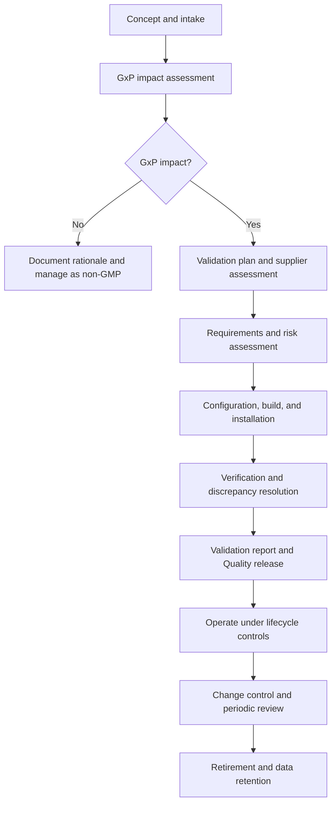

# 01-SOP-CSV: Computerised System Validation

> **Purpose of this document:** Provide a practical, risk-based procedure for validating and maintaining GMP computerised systems using GAMP 5 principles, Annex 11 expectations, FDA electronic-record controls, and current data integrity thinking.

---

## 1. Purpose

This SOP defines how GMP computerised systems are assessed, specified, configured, verified, released, operated, changed, periodically reviewed, and retired.

The procedure is designed to ensure that each system is:

- fit for intended use
- proportionately validated based on patient safety, product quality, and data integrity risk
- controlled throughout its lifecycle
- supported by clear ownership, supplier oversight, records, and objective evidence
- maintained in a validated state after release

The approach follows the GAMP 5 principle that validation effort should be driven by intended use, process understanding, supplier knowledge, system complexity, and documented risk.

## 2. Scope

This SOP applies to computerised systems used in GMP activities or used to create, modify, maintain, archive, retrieve, transmit, calculate, report, or approve GMP records.

### 2.1 In scope

- Manufacturing, packaging, laboratory, warehouse, engineering, maintenance, calibration, quality, document management, training, and batch release systems.
- Software applications, configured platforms, spreadsheets, databases, reports, interfaces, automation, PLC/SCADA/HMI, LIMS, MES, QMS, ERP GMP modules, CDS, EMS/BMS, data historians, electronic logbooks, and electronic document systems.
- Infrastructure supporting GMP applications, such as servers, cloud services, networks, identity management, backup, restore, storage, virtual platforms, and managed service providers.
- New systems, major upgrades, configuration changes, data migrations, interface changes, report changes, security model changes, and retirement.

### 2.2 Out of scope

- Non-GMP business systems with no impact on patient safety, product quality, data integrity, regulatory submissions, or required GMP records.
- General office tools used only for informal communication or drafting, unless they become the controlled system of record for GMP data.
- Embedded firmware or software may be covered within equipment qualification only when the assessment confirms it does not independently control a critical GMP function, alarm, recipe, parameter, calculation, data flow, or GMP record. Embedded software that performs a critical GMP function still requires documented computerised-system controls proportionate to risk, even when it is qualified with the equipment.

## 3. References

- ISPE GAMP 5, A Risk-Based Approach to Compliant GxP Computerized Systems, Second Edition.
- EU GMP Annex 11, Computerised Systems.
- EU GMP Annex 15, Qualification and Validation.
- EU GMP Chapter 4, Documentation.
- FDA 21 CFR Part 11, Electronic Records; Electronic Signatures.
- FDA 21 CFR 211.68, 211.100, 211.160, 211.180, 211.186, 211.188, 211.192, 211.194.
- FDA Guidance for Industry: Data Integrity and Compliance With Drug CGMP: Questions and Answers.
- FDA Guidance: Computer Software Assurance for Production and Quality Management System Software, used as supportive risk-based assurance thinking where applicable; this device-focused guidance is not the primary legal basis for drug GMP CSV.
- FDA Guidance: General Principles of Software Validation, used for general validation principles where applicable; this device-focused guidance is not the primary legal basis for drug GMP CSV.
- ICH Q9(R1), Quality Risk Management.
- ICH Q10, Pharmaceutical Quality System.
- Site procedures for change control, deviation, CAPA, supplier qualification, document control, training, data integrity, backup and restore, cybersecurity, and disaster recovery.

## 4. Principles

### 4.1 Intended use drives validation

Validation must prove that the system performs its intended GMP use reliably. Do not validate unused vendor features simply because they exist. Do validate the configured functions, records, reports, interfaces, calculations, access controls, and workflows that support GMP decisions.

### 4.2 Risk drives effort

The level of specification, supplier oversight, testing, documentation, review, and approval must be commensurate with risk to patient safety, product quality, and data integrity.

### 4.3 Use supplier knowledge, but own the outcome

Supplier documentation, testing, certifications, release notes, and quality system evidence may reduce duplicate testing when assessed and justified. The regulated company remains accountable for intended use, configuration, data integrity, release, operation, and inspection readiness.

### 4.4 Critical thinking is required

Validation is not a checklist exercise. Teams must decide what evidence is necessary, why it is sufficient, and where more rigor is needed.

### 4.5 Lifecycle control is mandatory

Validation does not end at go-live. Systems must remain controlled through change control, incident management, backup and restore, security review, periodic evaluation, supplier monitoring, and retirement.

## 5. Definitions

- **Computerised system:** Software and hardware components that together perform one or more functions.
- **Application:** Software installed or accessed on a defined platform to provide business or GMP functionality.
- **Infrastructure:** Hardware, network, platform, database, operating system, cloud, storage, or support services that allow an application to operate.
- **GxP impact:** Potential impact on patient safety, product quality, data integrity, regulatory commitments, or required GMP records.
- **Intended use:** The approved GMP purpose and boundaries for which the system will be used.
- **System Owner:** Person accountable for system availability, validated state, access, lifecycle records, periodic review, and retirement.
- **Process Owner:** Person accountable for the GMP process supported by the system.
- **Validation Lead:** Person accountable for validation planning, traceability, verification strategy, and validation report.
- **Supplier:** Vendor, developer, cloud provider, service provider, integrator, or internal IT group providing or maintaining system components or services.
- **Configuration:** Parameter, setting, workflow, role, report, calculation, recipe, master data rule, or other controlled setup that affects system behavior.
- **Electronic record:** GMP record in digital form that is created, modified, maintained, archived, retrieved, transmitted, or used by a computer system.
- **Audit trail:** Secure, computer-generated, time-stamped record of actions that create, modify, delete, approve, or otherwise affect GMP records or system state.
- **Direct GxP impact:** The system directly controls, records, calculates, approves, or reports GMP activity or GMP data used for product quality or release decisions.
- **Indirect GxP impact:** The system supports a GxP process or another validated system but does not itself make or record the final GMP decision.
- **ERES:** Electronic records and electronic signatures.

## 6. Roles and Responsibilities

| Role | Responsibilities |
| --- | --- |
| Process Owner | Defines intended use, business process, GMP records, critical controls, user requirements, acceptance criteria, and process release readiness. |
| System Owner | Maintains system inventory entry, validation package, access model, support model, backup/restore controls, periodic review, supplier oversight, and retirement records. |
| Quality Unit | Approves GxP impact, risk approach, validation plan, release decision, change controls, deviations, periodic review conclusions, and retirement where GMP impact exists. |
| Validation Lead | Plans and coordinates validation activities, traceability, testing strategy, discrepancy handling, report, and release recommendation. |
| IT / Infrastructure Owner | Provides installation, environment, security, backup, restore, monitoring, infrastructure qualification, and technical support evidence. |
| Supplier / Service Provider | Provides lifecycle documentation, specifications, test evidence, release notes, defect information, support records, and quality evidence as agreed. |
| Users / SMEs | Review requirements, execute or support verification, confirm process fit, and report incidents or data integrity concerns. |
| Data Owner | Defines record retention, archive, migration, review, reporting, and data integrity controls for the data set. |
| Qualified Person (QP), where applicable | Confirms batch certification or release systems restrict certification to authorized QPs and record the certifying person through approved controls, including electronic signature where used. |

One person may hold more than one role in a small site, but Quality approval authority, system ownership, process ownership, and independent review of critical evidence must remain clear.

### 6.1 Approval matrix

| Lifecycle gate | Required owner | Required approval / review |
| --- | --- | --- |
| Intake and inventory | System Owner | Process Owner review; Quality review for GxP impact. |
| GxP impact and validation route | System Owner | Quality approval. |
| Validation plan | Validation Lead | Process Owner, System Owner, IT/Infrastructure Owner, and Quality approval. |
| Requirements and risk assessment | Process Owner | Validation Lead and Quality review; SMEs where applicable. |
| Supplier evidence acceptance | System Owner | Validation Lead and Quality review; Supplier Quality where risk requires it. |
| Production release | System Owner / Process Owner | Quality approval before routine GMP use. |
| Batch release or certification function release | System Owner / Process Owner | Quality and QP review where EU batch certification or QP release functionality is affected. |
| Periodic review | System Owner | Process Owner and Quality approval. |
| Retirement | System Owner | Data Owner, Process Owner, IT, and Quality approval. |

## 7. System Lifecycle Overview

## 8. Procedure

### 8.1 Intake and system inventory

1. Open an intake record or change control before purchasing, building, configuring, upgrading, or retiring a GMP-relevant system.
2. Assign a System Owner and Process Owner.
3. Add or update the system inventory with:
   - system name and unique ID
   - owner
   - supplier
   - intended use
   - supported GMP process
   - GxP impact status
   - validation status
   - system category or complexity rationale
   - hosting model and environments
   - interfaces
   - GMP records and retention expectations
   - periodic review frequency
4. If the system is determined non-GMP, document the rationale and approval. Reassess if intended use changes.

### 8.2 GxP impact assessment

Assess whether the system:

- controls or monitors a GMP process
- generates, modifies, stores, transmits, calculates, reports, archives, or approves GMP data
- supports batch release, quality decision-making, regulatory submissions, complaints, deviations, CAPA, training, document control, laboratory testing, manufacturing, packaging, storage, or distribution
- controls access to GMP records or systems
- affects process parameters, alarms, recipes, calculations, specifications, labels, or status decisions
- replaces a manual GMP control

If any answer is yes, the system is in scope for this SOP. Use the impact level to scale deliverables, testing depth, approval level, and periodic review frequency.

| Impact level | Use when | Minimum route |
| --- | --- | --- |
| Non-GMP | No credible impact on patient safety, product quality, data integrity, regulatory commitments, or required GMP records. | Document rationale and reassess if intended use changes. |
| GMP-supporting low risk | Supports a GMP activity indirectly, with no critical record, calculation, approval, or process control and with errors readily detected before a GMP decision. | Inventory entry, intended use, basic risk rationale, supplier or configuration evidence where relevant, limited verification, Quality-approved route. |
| Infrastructure supporting GxP | Provides platform, identity, network, storage, backup, hosting, monitoring, or security services for one or more GxP systems. | Infrastructure qualification or control evidence, shared responsibility definition, change control, backup/restore or continuity evidence, supplier/service assessment, periodic review. |
| Direct GxP critical | Controls, calculates, records, approves, reports, or transfers data used for GMP execution, quality decisions, batch release, or regulatory commitments. | Full risk-based validation lifecycle with approved requirements, risk assessment, verification, traceability, data integrity controls, release approval, and periodic review. |

Also assess data criticality and system criticality. Data criticality considers how the data are used in GMP decisions. System criticality considers the consequence if the system is unavailable, wrong, insecure, or uncontrolled.

### 8.3 System categorisation and complexity assessment

Categorise the system to support planning. The category does not automatically determine validation effort; intended use and risk do.

| Type | Examples | Typical approach |
| --- | --- | --- |
| Infrastructure platform | Network, server, database, identity provider, storage, backup platform, cloud service supporting GMP systems. | Qualify or verify infrastructure controls, supplier/service controls, monitoring, backup/restore, access, security, and change management. |
| Non-configured software | Commercial software used mostly as delivered. | Confirm intended use, supplier evidence, installation, access, records, and critical functions. |
| Configured software | LIMS, QMS, ERP module, MES, CDS, eDMS, EMS/BMS configured by workflow, roles, reports, recipes, or master data. | Specify user requirements and configuration; verify critical configured functions, records, reports, interfaces, calculations, and access controls. |
| Custom or bespoke software | Internally developed or heavily customized application, code, script, macro, integration, or report logic. | Apply stronger lifecycle controls, design/specification evidence, code/configuration review, testing across risk areas, release control, and maintainability controls. |

Document the category, supplier maturity, novelty, complexity, configuration level, and risk rationale in the validation plan or assessment.

### 8.4 Supplier and service-provider assessment

Assess suppliers and service providers before relying on their products, hosted services, or evidence.

Assessment may include:

- supplier questionnaire
- quality agreement or technical agreement
- review of quality system certification or audit report
- review of software development lifecycle controls
- review of release notes, defect handling, support model, backup and restore, security, business continuity, and data handling
- supplier audit based on risk
- review of standard test evidence and traceability

Supplier evidence may be leveraged when:

- the supplier is competent and reliable for the intended service
- the evidence is relevant to the version and configuration used
- the regulated company reviews and accepts it
- gaps are covered by local verification

Supplier evidence must not replace verification of site-specific intended use, configuration, data integrity controls, interfaces, migration, reports, or operating procedures.

### 8.4.1 Supplier evidence acceptance and SaaS checks

Before leveraging supplier evidence, document an acceptance and gap assessment covering:

- exact product, version, service release, module, and configuration scope
- supplier development and testing lifecycle
- known defects, open limitations, and release notes relevant to intended use
- shared responsibility between supplier, hosting provider, IT, Quality, and the regulated user
- release cadence, forced upgrades, patch windows, and customer notification timing
- subcontractors or critical service providers used by the supplier
- data location, ownership, export, retention, backup, restore, and deletion responsibilities
- support access, remote access, service-level expectations, and incident notification timing
- cybersecurity, vulnerability notification, and security monitoring expectations
- right to audit or equivalent assurance, such as third-party reports, certifications, or customer audit summaries
- exit plan, including data export, archive, and transition support

For SaaS or hosted systems, also define tenant configuration ownership, validation responsibilities after vendor releases, how release notes are triaged, when regression assessment is required, and how supplier-forced changes are approved before or after deployment.

### 8.5 Validation planning

Create a validation plan for each GxP-impacting system or group of systems. For small low-risk changes, the approved change record may serve as the validation plan if it contains the required information.

The plan must define:

- purpose and scope
- system owner, process owner, validation lead, Quality approver, IT owner, and SMEs
- intended use and boundaries
- system architecture, interfaces, environments, and data flows
- GxP impact and risk approach
- supplier assessment strategy
- required deliverables
- requirements strategy
- verification strategy and test types
- data migration or interface strategy
- Part 11 / Annex 11 control assessment
- supplier evidence acceptance and gap assessment, if supplier evidence is used
- deviation and discrepancy handling
- acceptance criteria for release
- operating controls after release
- periodic review frequency

### 8.6 User requirements

User requirements must describe what the system must do for the GMP process. Requirements must be clear, testable where practical, and traceable for GxP-critical functions.

Requirements should cover:

- intended use and process workflow
- GMP records and metadata
- data entry, review, approval, reporting, export, and archive
- calculations and formulas
- roles, permissions, and segregation of duties
- audit trail generation and review
- electronic signatures, if used
- interfaces and data transfers
- data migration
- backup, restore, retention, and retrieval
- security and session controls
- alarms, limits, exception handling, and status decisions
- business continuity and manual fallback
- report content and controlled printouts
- configuration and master data controls

Avoid vague requirements such as "system must be Part 11 compliant." State the actual controls required for intended use.

### 8.7 Risk assessment

Perform a documented risk assessment focused on patient safety, product quality, and data integrity.

For each critical function or process step, consider:

- what could go wrong
- potential impact on patient, product, process, record, or decision
- existing controls
- detectability before product release or quality decision
- required risk controls
- verification depth needed

Use a simple risk ranking method that the site can apply consistently. High-risk functions require stronger evidence, independent review, negative testing, boundary testing, audit trail checks, and Quality approval.

Examples of higher-risk functions:

- batch release status
- electronic signature approvals
- calculation of assay, potency, yield, expiry, or specification result
- recipe, parameter, alarm, or limit control
- audit trail for GMP data changes
- data migration from a legacy system
- interface transferring batch, sample, result, or material status data
- access role that can change released records or critical configuration
- backup/restore for sole-copy electronic GMP records

### 8.8 Specification and configuration

Define enough specification to build, configure, verify, operate, and maintain the system.

Depending on risk and complexity, documentation may include:

- functional specification
- configuration specification
- design specification
- interface specification
- report specification
- data migration mapping
- security and role matrix
- infrastructure specification
- backup and restore design
- disaster recovery or business continuity plan

Configuration must be controlled. Changes to configuration after approval must follow change control.

### 8.9 Installation and environment verification

Verify that the system is installed or provisioned in the approved environment.

Evidence may include:

- installation record or deployment record
- version and build confirmation
- environment name and purpose
- infrastructure qualification or platform control evidence
- database and service configuration
- network and connectivity checks
- time synchronization
- backup job setup
- access provisioning
- antivirus, endpoint, logging, monitoring, and security controls where applicable
- segregation of development, test, and production environments where risk requires it

### 8.10 ERES / Annex 11 applicability assessment

For systems that create, modify, maintain, archive, retrieve, transmit, approve, or submit GMP records electronically, complete an ERES / Annex 11 applicability and gap assessment.

The assessment must decide and justify applicability for:

- predicate-rule or GMP record requirements that make the electronic record or electronic signature relevant
- designation of the authoritative record when paper, electronic, and hybrid records coexist
- electronic records, electronic signatures, or hybrid paper/electronic records
- closed-system or open-system controls
- record copies in human-readable and electronic form
- record retention, retrieval, archive, and readability
- audit trails and audit trail review
- signature manifestation, meaning, date/time, and permanent linking to the record
- authority checks and role-based permissions
- operational checks that enforce required sequence or status controls
- device, instrument, or interface checks where the source of data matters
- user identity controls, password controls, and e-signature accountability
- identity verification before assigning electronic signature authority
- electronic-signature certification or local equivalent where required by the applicable regulatory framework
- system documentation, inventory, system description, and data flows
- backup, restore, business continuity, and disaster recovery controls
- additional open-system controls, such as encryption or digital signature controls, where records are transmitted or accessed outside the responsible organization's controlled environment

Each applicable control must have one of these outcomes: technically verified, covered by reviewed supplier evidence, controlled by an approved procedure where regulations allow procedural control, or remediated before release. Residual gaps may be accepted only when the applicable regulation permits the approach, compensating controls are approved by Quality, product quality and data integrity remain protected, and remediation is tracked where required.

### 8.11 Verification strategy

Verification must be designed from requirements and risk. Use the least burdensome method that provides reliable evidence.

| Method | Appropriate use | Minimum evidence |
| --- | --- | --- |
| Scripted testing | High-risk, complex, novel, customized, or critical functions. | Pre-approved objective, steps or test design, data set, expected result, actual result, pass/fail, tester/date, version/build, evidence, discrepancy handling, and approval. |
| Unscripted testing with documented evidence | Lower-risk workflows where tester judgment is useful and objective evidence is still captured. | Objective, tester/date, version/build, test data, observed result, pass/fail conclusion, evidence where useful, and defect handling. |
| Supplier evidence review | Standard vendor functions not changed by site configuration and supported by relevant supplier evidence. | Evidence source, version match, scope match, reviewer, gap assessment, and local verification for site-specific use. |
| Configuration inspection | Settings, roles, workflows, reports, calculations, recipes, or master data rules. | Approved configuration baseline, inspected values, reviewer, date, discrepancies, and approval. |
| Automated testing | Repeatable regression or calculation checks where the tool and environment are suitable. | Tool suitability assessment, script/version control, test data, results, exceptions, and review. |
| Independent calculation/report check | Reports, formulas, spreadsheets, or calculations used for GMP decisions. | Independent expected result, comparison, tolerance, reviewer, and discrepancy handling. |

High-risk functions require pre-approved objectives, negative or boundary testing where failure modes matter, independent review where appropriate, and regression rationale for upgrades, patches, configuration changes, and supplier releases.

Testing must include expected results and actual results. Failures, unexpected outcomes, and deviations must be documented, assessed, corrected, retested where necessary, and approved before release.

### 8.12 Minimum verification expectations

For GxP-impacting systems, verify the following unless justified as not applicable:

- approved version/build or service release
- intended use workflows
- critical user requirements
- critical configuration
- user roles and access restrictions
- audit trail creation, content, availability, and review process
- electronic signatures, if used
- record creation, modification, review, approval, retrieval, export, and printout where applicable
- calculations and reports used for GMP decisions
- interfaces and data transfers
- backup and restore for GMP records
- data migration completeness and accuracy, if applicable
- exception handling for critical errors
- business continuity or manual fallback for critical processes
- security controls proportionate to risk

### 8.13 Traceability

Maintain traceability for GxP-critical requirements from requirement to risk control to configuration or specification to verification evidence.

Traceability may be a formal matrix or a clearly controlled set of linked records. It must allow a reviewer to answer:

- which requirements are GxP-critical
- what risk each critical requirement controls
- which configuration item, specification, supplier evidence, or procedural control supports the requirement
- where each critical requirement was verified
- whether verification passed
- which SOP or training item is required when procedural controls are relied on
- whether unresolved issues remain

### 8.14 Data integrity and electronic record controls

Assess and verify controls for electronic GMP records.

At minimum, consider:

- unique user accounts
- access limited to authorized users
- role-based permissions and segregation of duties
- password or authentication controls
- audit trails for creation, modification, deletion, and approval of GMP records
- reason for GMP-relevant changes where required
- audit trail review procedure and frequency
- electronic signatures linked to records and showing signer, meaning, date, and time
- complete and accurate record copies in human-readable and electronic form
- record retention, backup, archive, retrieval, and readability
- metadata needed to reconstruct the GMP activity
- controls over dynamic records, including original data and reprocessing history
- prevention or detection of unauthorized data changes
- time synchronization
- data transfer checks
- secure disposal at end of retention

Where the system lacks a required technical control, define a procedural control only if it is realistic, reliable, trained, and approved by Quality. Procedural controls must not be used to excuse avoidable high-risk technical gaps without justification and remediation planning.

### 8.15 Data migration

Data migration must be planned and verified when GMP data move between systems or formats.

The migration plan must define:

- source and target systems
- data scope and exclusion rationale
- data profiling results and known data quality issues
- field mapping
- transformation rules
- approved data cleansing rules
- dry-run or rehearsal approach for higher-risk migrations
- migration freeze and cutover controls
- reconciliation approach
- record counts, control totals, checksums, or other completeness checks where practical
- exception reports and failed-record handling
- sample versus 100 percent reconciliation rationale
- acceptance criteria
- handling of failed or rejected records
- retention of legacy records
- legacy system lockdown or read-only controls
- access to retired data
- rollback or contingency plan
- business sign-off and Quality approval

Verification must confirm that data are not altered in meaning or value during migration. Include metadata and audit trail considerations where required. After migration, verify that retained data can be retrieved and understood by an authorized user.

### 8.16 Interfaces

Interfaces transferring GMP data must be specified and verified.

Define the source owner, receiving owner, interface owner, support owner, and escalation route. Verify:

- correct source and destination
- required fields and metadata
- data format and units
- transfer frequency
- monitoring frequency, alerting, and queue management
- error handling and retry logic
- manual reprocessing rules
- rejected record handling
- reconciliation or completeness checks
- master-data dependencies
- security controls
- audit trail or transfer log
- impact of downtime
- coordinated change assessment when either connected system changes

### 8.17 Validation report and release

Before production use, prepare a validation report or release summary.

The report must include:

- scope and system version/configuration released
- summary of deliverables completed
- requirements and risk coverage
- verification summary
- deviations, discrepancies, and resolutions
- open issues and risk-based justification, if any
- confirmation that procedures and training are complete
- confirmation that support, backup, restore, security, and monitoring are in place
- recommendation for release or rejection

Quality must approve release before the system is used for routine GMP work.

## 9. Operation and Maintenance

### 9.1 Operating procedures

Before release, approved procedures must define how the system is used and controlled. Procedures may include:

- user administration
- audit trail review
- backup and restore
- incident management
- change control
- periodic review
- report generation and review
- master data and configuration management
- business continuity
- supplier support and remote access
- data archival and retrieval

### 9.2 Access management

Access must be controlled throughout operation.

Minimum expectations:

- unique user IDs
- no shared accounts for GMP actions, reviews, approvals, data entry, configuration, record modification, or any activity requiring attribution
- shared read-only viewing accounts only where justified, controlled, and unable to create, modify, delete, approve, or otherwise affect GMP records or configuration
- role-based access based on job need
- documented approval for access creation and changes
- timely removal of access for leavers and role changes
- periodic access review
- privileged access restricted and monitored
- supplier or remote access authorized, time-bound, and recorded

### 9.3 Audit trail review

Audit trails must be reviewed based on risk and GMP relevance. Audit trails that capture changes to GMP data or records must be reviewed with the associated GMP record before batch release, sample approval, product-quality decision, or other defined quality decision where the audit trail is part of confirming record integrity.

The procedure must define:

- which audit trails are reviewed
- when review occurs, such as batch release, sample approval, periodic review, or event-based review
- who reviews them
- what events require investigation
- how review is documented
- how unusual or unauthorized activity is escalated

### 9.4 Backup, restore, archive, and retention

Systems containing GMP records must have backup, restore, archive, and retention controls proportionate to risk.

Expectations:

- backup schedule defined
- backup success monitored
- restore tested during validation and periodically thereafter
- archive preserves data, metadata, audit trails, and meaning
- records remain readable and retrievable for the retention period
- retention and disposal follow approved schedules

### 9.5 Incident and deviation management

System incidents that could affect GMP data, process control, validated state, or product quality must be assessed under deviation or incident procedures.

Examples:

- data loss or suspected data corruption
- unauthorized access
- audit trail disabled or unavailable
- calculation or report error
- failed backup or failed restore
- interface failure affecting GMP data
- use of wrong version, wrong configuration, or wrong recipe
- system outage affecting critical process control

Critical incidents require root cause assessment and CAPA where appropriate.

### 9.6 Change control and configuration management

Changes to GxP-impacting systems must follow formal change control.

Examples:

- software upgrade, patch, hotfix, or version change
- configuration, workflow, report, recipe, role, permission, calculation, or master data rule change
- infrastructure, hosting, database, backup, identity, or interface change
- supplier change or service model change
- restoration from backup into production
- data migration or archive change
- cybersecurity control change affecting access or records

Each change must assess validation impact and define verification before release.

The change assessment must explicitly address:

- emergency or security patch urgency and post-implementation verification
- supplier-forced release timing and release-note review
- known defects, resolved defects, and regression impact
- rollback or backout plan
- temporary workaround controls
- training, SOP, report, interface, access, and periodic-review impact
- whether the system remains in a validated state after the change

### 9.7 Spreadsheets and end-user computing

Spreadsheets, macros, scripts, local databases, and user-built reports used for GMP decisions must be controlled according to risk.

Minimum expectations:

- inventory entry or controlled register for GMP-impacting tools
- owner, intended use, location, version, and approved template identified
- formulas, macros, scripts, locked cells, protected ranges, and hidden fields reviewed
- input cells separated from protected calculation or logic cells where practical
- test cases cover normal, boundary, and error conditions for critical calculations
- independent check of formulas or report logic used for GMP decisions
- access and storage controls protect the approved version from unauthorized change
- changes use document control or change control according to risk
- periodic review confirms continued use, owner, location, version, and formula integrity
- retirement preserves required records and prevents obsolete template use

## 10. Periodic Review

Periodic reviews confirm that the system remains in a validated and compliant state.

Frequency must be based on risk, system criticality, complexity, supplier history, and incident history. Critical systems should usually be reviewed at least annually unless justified otherwise.

Periodic review must consider:

- current intended use
- system inventory accuracy
- validation package completeness
- open incidents, deviations, problems, CAPA, and changes
- upgrade and patch history
- user access review
- audit trail review effectiveness
- backup and restore evidence
- disaster recovery or continuity test status
- supplier performance and quality notifications
- security vulnerabilities and remediation
- system performance and reliability
- data retention and archive status
- SOP and training status
- whether revalidation, remediation, or retirement is needed

The periodic review must conclude one of the following: validated state maintained, remediation required, revalidation required, retirement recommended, or scope/intended use reassessment required. Quality must approve the periodic review conclusion for GxP-impacting systems.

Overdue periodic reviews must be escalated to the System Owner's management and Quality. Perform an out-of-cycle review after major incidents, supplier quality concerns, repeated access findings, unresolved critical vulnerabilities, failed restore tests, significant system downtime, or major supplier releases.

## 11. Retirement

System retirement must be controlled through change control.

The retirement plan must define:

- reason for retirement
- replacement system or manual process, if any
- final data backup and archive
- migration or export requirements
- record retention and retrieval process
- audit trail and metadata retention
- access restrictions after retirement
- decommissioning steps
- supplier contract or service termination
- cybersecurity and data disposal controls
- verification that required records remain readable and retrievable

Do not decommission a system containing GMP records until record retention, retrieval, and inspection access are assured.

## 12. Required Records

The validation package may include:

- system inventory entry
- GxP impact assessment
- supplier assessment
- validation plan
- system description or architecture diagram
- user requirements
- risk assessment
- specifications, configuration records, and role matrix
- installation or deployment evidence
- test scripts, exploratory test records, supplier evidence review, and verification results
- traceability matrix or linked equivalent
- discrepancy and deviation records
- data migration records
- interface verification records
- Part 11 / Annex 11 assessment
- training records
- validation report and release approval
- change controls
- periodic reviews
- retirement plan and evidence

Records must be controlled, reviewed, approved, retained, and available for inspection.

## 13. Practical Deliverable Scaling

| System risk / complexity | Practical deliverable set |
| --- | --- |
| Low GxP impact, standard software, no critical records | GxP assessment, intended use statement, supplier evidence review if applicable, access check, limited verification, release approval. |
| GMP-supporting infrastructure or low-risk SaaS | Inventory entry, shared responsibility review, supplier/service evidence, access/security checks, backup or export expectation, limited verification of intended support function, Quality-approved rationale. |
| Moderate risk configured system | Validation plan, requirements, configuration specification, risk assessment, supplier assessment, scripted or documented verification of critical functions, traceability, report, procedures, training. |
| High-risk or complex system | Full lifecycle package, detailed requirements/specifications, supplier audit or strong supplier evidence, risk-based scripted testing, negative and boundary testing, data integrity control verification, migration/interface verification, traceability, independent review, Quality release, periodic review. |
| Custom or bespoke system | Lifecycle controls for design/build/test/release, code or configuration review where appropriate, controlled environments, enhanced defect management, enhanced traceability, stronger regression testing, maintainability and support assessment. |

## 14. Practical Checklists

### 14.1 Before approval to build or configure

- System Owner and Process Owner assigned.
- Intended use is clear.
- GxP impact assessment is complete.
- Supplier or service-provider assessment is planned or complete.
- GMP records and data flows are understood.
- Requirements and risk method are defined.
- Validation plan is approved.

### 14.2 Before production release

- Requirements are approved.
- Critical risks have controls.
- Configuration is approved and under control.
- Verification passed or deviations are approved.
- Traceability covers critical requirements.
- Audit trail, access, backup/restore, reports, interfaces, and migration are verified where applicable.
- SOPs and training are effective.
- Support model is defined.
- Validation report is approved by Quality.

### 14.3 SaaS / hosted-service checklist

| Item | Evidence / reference |
| --- | --- |
| Shared responsibility defined | |
| Tenant configuration approved | |
| Supplier release cadence and notification understood | |
| Forced-upgrade and regression assessment process defined | |
| Data location, backup, restore, export, and deletion responsibilities defined | |
| Audit trail and record-copy access verified | |
| Support and remote access controls approved | |
| Security and incident notification process reviewed | |
| Exit plan and data retrieval approach defined | |

### 14.4 During operation

- Access is reviewed.
- Audit trails are reviewed as defined.
- Backups are monitored and restore is periodically tested.
- Changes are controlled.
- Incidents are assessed for GMP impact.
- Supplier notices are reviewed.
- Periodic review confirms validated state.

### 14.5 Periodic review output checklist

| Output | Record |
| --- | --- |
| Validated state maintained, remediation required, revalidation required, retirement recommended, or scope reassessment required | |
| Open incidents, deviations, CAPA, changes, and supplier issues reviewed | |
| Access, audit trail, backup/restore, security, and training status reviewed | |
| Remediation owner and due date assigned where needed | |

### 14.6 Retirement checklist

| Item | Evidence / reference |
| --- | --- |
| Replacement process or system approved | |
| Final backup, archive, or export complete | |
| Data, metadata, audit trails, and record meaning retained where required | |
| Retrieval test completed | |
| Legacy access restricted or system locked down | |
| Supplier service termination and data disposal controlled | |
| Quality retirement approval complete | |

## 15. Common Failure Modes and Expected Controls

| Failure mode | Required control |
| --- | --- |
| System bought before intended use is defined | Require intake, owner assignment, and GxP assessment before purchase or build. |
| Validation tests unused vendor features but misses site workflow | Base requirements and verification on intended use and process risk. |
| Supplier evidence accepted without review | Assess supplier competence and evidence relevance before leveraging it. |
| Audit trail exists but is never reviewed | Define review scope, timing, reviewer, and escalation criteria. |
| Shared accounts obscure attribution | Prohibit shared accounts for GMP actions, reviews, approvals, data entry, configuration, record modification, or any activity requiring attribution; allow only justified read-only viewing accounts that cannot affect records or configuration. |
| Configuration changes bypass validation | Route configuration changes through change control with validation impact assessment. |
| Data migration changes record meaning | Define mapping and reconciliation, then verify data value, meaning, metadata, and retrieval. |
| Backup exists but restore is unproven | Test restore during validation and periodically based on risk. |
| System remains live after validation expires or owner leaves | Maintain inventory, ownership, access review, and periodic review. |

## 16. Appendix A - Example User Requirement Format

Use this format when a formal requirements document is needed:

| Field | Example |
| --- | --- |
| Requirement ID | URS-ALM-001 |
| Requirement | The system must record alarm acknowledgement with user ID, date, time, alarm ID, and comment. |
| GxP critical? | Yes |
| Rationale | Alarm acknowledgement supports investigation of environmental excursions. |
| Risk control | Unique user access, audit trail, required comment, alarm report review. |
| Verification | Test ALM-003, audit trail review ATR-002. |

## 17. Appendix B - Example Risk Ranking

| Rank | Meaning | Typical validation response |
| --- | --- | --- |
| High | Failure could affect patient safety, product quality, release decision, critical record integrity, or regulatory commitment and may not be easily detected. | Formal requirements, stronger specification, scripted testing, negative/boundary tests, independent review, Quality approval, periodic monitoring. |
| Medium | Failure could affect GMP execution or records but is detectable before release or quality decision. | Documented requirement, targeted verification, procedural controls, reviewer approval. |
| Low | Failure has limited GMP impact or is readily detected and corrected with no product quality impact. | Basic verification, supplier evidence review, or documented rationale. |

## 18. Appendix C - Example Validation Summary Statement

The system was validated for the intended GMP use defined in the approved user requirements. Critical requirements were assessed for patient safety, product quality, and data integrity risk. Verification evidence demonstrates that the approved configuration, access controls, audit trail, reports, interfaces, backup/restore controls, and operating procedures are suitable for release. Open items listed in the report do not prevent GMP use because they are controlled by approved workarounds and tracked to completion.

---

*This SOP aligns with GAMP 5 risk-based lifecycle principles, EU GMP Annex 11 expectations for validation and operational control of computerised systems, FDA Part 11 expectations for electronic records and signatures, and current FDA data integrity guidance.*
